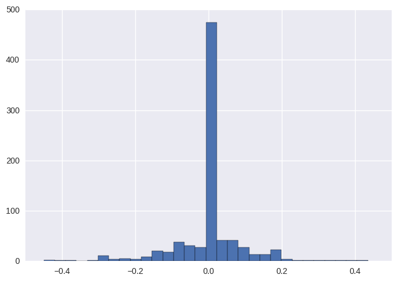
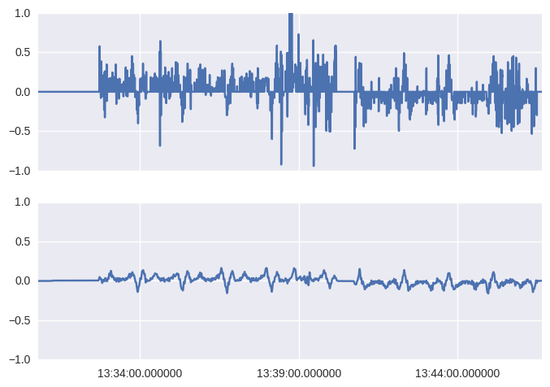
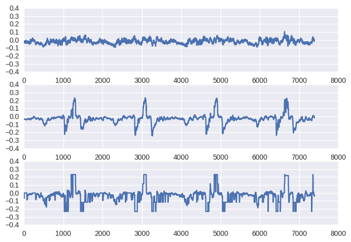

# Behavioral Cloning

## Problem Description

The goal of this project is to train and tune a **Convolutional Neural Network**, which will predict steering angle base on image input, and eventually instruct the car in a simulator to **drive around race track autonomously**.

The training data are generated as follows:

  * A human operator take control of the car (steer, accelerate and brake), to drive around a given track. In the meantime, the simulator logged the steering angle, speed, and the 3 images of the road ahead (as if 3 forward-facing cameras are mounted on the car's left, middle and right).

The setup of this course project follows similar idea as this Nvidia paper: ["End to End Learning for Self-Driving Cars"](http://images.nvidia.com/content/tegra/automotive/images/2016/solutions/pdf/end-to-end-dl-using-px.pdf), except the work of Nvidia used real car instead of computer simulator.

## Result

Here is a [video showing the car drive autonomously](https://youtu.be/4ZLU2h13Elg) in the simulator

## Choose a Network Architecture

I followed the architecture described in Nvidia's paper, but I multiplied the depth of Conv2D layers and number of neurons in Dense layers. The intuition is that, comparing with real-world data in Nvidia's paper, the picture/steering generated from the simulator have higher variance , so a increased power of CNN is needed.
	
	
### Architecture Characteristics,

  * The architecture is featured by 4 Conv2D layers in a row then followed by 4 Dense layers in a row.
  * The 4 Conv2D layers are with increasingly greater depth, the shallower ones are mean to catch the common features shared by different patterns and structures. The final layer are deepest one as it can represent more high level structures composed by features generated in previous layer.
  * On the other hand, the complexity of dense layers are in a descending order. Because the ones that just followed Conv2D layer are meant to resolve most complex interactions among features and gradually towards a single dimension regression problem.
  * No pooling or dropout layers were used. Empirically, I did not find them helpful in obtaining a working model more easily, I think the project itself is try to 'overfitting' the track, since we are training and testing the model on the same track.

## Data Preprocessing and Model Training

### Analysis of Training data and fine-tuning data

There are 3 types of situations concerning steering:

  * Straight Road
  * Gentle Turn
  * Sharp Turn

For the first two type of road, the tolerance for inaccurate steering is higher and the car has the chance to "recover" from a not-so-timely or inaccurate steering.

For the sharp turn, both timing and steering angle need to be accurate, no chance to compensate the mis-operation.
For the training track, the generated data are dominantly skew towards the first two types of road.

### Histogram of steering angles from Udacity's training data.

### Find a Training Process

#### After realize such property, I decide to:
  1. Get a basic model, i.e. the car can drive strictly straight in straight roads and properly steering in gentle turns,  but may fail on sharp turns.
  2. Using basic model to semi-autonomously drive around the track, when approaching sharp bends, human operator give timely and accurate steering command. Thus higher quality data was recorded.
  3. With decreased learning rate, train the basic model with newly generated data to get the final model.

I will going into more detail for above steps that lead me to a working model.
		
## Details of Training process

To get a basic model described above, By apply two butter filter to steering and get their weighted sum, I effectively limited the max steering angle in the training data to +/- 0.17. This greatly reduce the noise introduced by human operator. Of course, it also caused the model lose the ability to react properly to the sharp turns.

#### Original (top) and filtered (bottom) steering values in training data
	

Next step, following methods were used to recorded higher quality data, to improve the basic model:

  1. I modify the simulator code, so the car will by default drive autonomously under the instruction of the basic model, but once the operator starts to give steering command through keyboard, the car will follow the command of operator instead of the model. I call this semi-autonomous mode.

  2. For most part of the track, the car will drive under the instruction of basic model. When approaching sharp turns, operator will give timely and accurate steering command. The simulator still recorded all the steering angle, camera images and so on. Training data generated in this way has following properties:
 	a. near 0 steering on straight roads
   	b. smooth and 'just right' steering angle in bends, esp. the sharp ones.
    c. record 3-4 laps of data

3. Before fine tune the basic model, I implement a data augmentation mechanism , for each new training image: generate 8 random horizontally shifted pictures, between (-100, 100) pixels and adjust steering accordingly.  0.05 / 40 (angle per pixel)

4.	When fine tuning the basic model, I found the testing procedure is very time consuming and tedious. Unlike classical machine learning testing, we have to test through simulator, and one bad move will fail the whole model. So before I test each fine-tuned model, I visualize the prediction and comparing it with actual steering (judged by the similarity of line shapes), this can:
    1. be used as a indicator to decide when to stop training (avoid overfitting), or choosing proper learning rate, etc.
    2. Can pre-validate training result visually, so that only models that seemed reasonably good go to the simulator, this saves a lot of time.
    3. Can visually distinguish between models that are 'way off' and those are 'almost there' and thus abandon the former and keep working on the latter.

	#### Prediction steering from basic model (top), fine-tuned model (middle) and the target value (bottom)

## Conclusion and drawbacks
The successful implementation of the model, besides borrowing the CNN architecture from Nvidia's paper, is largely due to high quality of training data. Understanding the property of training data and nature of the track leads to the finding of described training steps and tricks. Also, the use of visualization to pre-check quality of the model provide transparence to the model. In future I could try [Dynamic Time Wrapping](https://en.wikipedia.org/wiki/Dynamic_time_warping) as distance measure to compare prediction result.

The main drawback of this method is it only overfit the training track the model will not work in a complete different track. Other than that the fine tuning process are largely manual and empirical.
	

